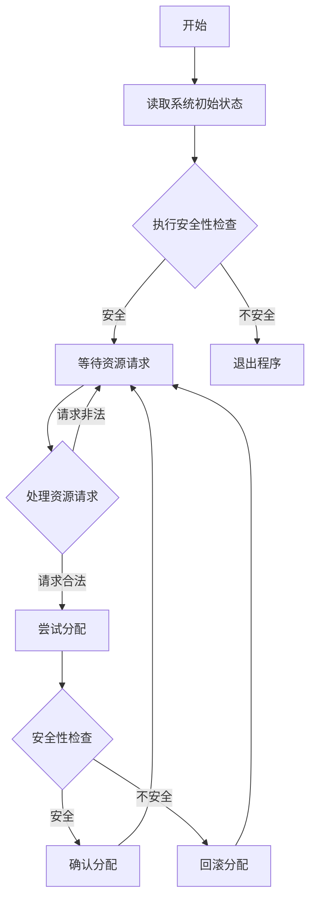

## 燕山大学《操作系统 A》大作业报告
**题目：** 银行家算法的设计与实现
**班级：** 22级软件工程1班
**学号：** 202211200227
**姓名：** ______
**指导教师：** 赵谷雨、何洪豆
**完成日期：** 2024年11月3日

### 一、 引言
在现代操作系统中，资源管理是至关重要的组成部分。多个进程并发执行时，不可避免地会竞争有限的系统资源，例如处理器、内存、I/O 设备等。若不妥善管理这些资源的分配与使用，极易导致死锁现象。死锁是指两个或多个进程因互相持有对方所需的资源而无限期地阻塞等待的局面。一旦发生死锁，轻则系统性能下降，重则导致系统崩溃。

为了避免死锁的发生，Edsger W. Dijkstra 提出了银行家算法。该算法的核心思想是通过模拟资源分配的过程，预先判断资源分配的安全性，从而避免系统进入死锁状态。本次大作业通过 Rust 语言实现银行家算法，不仅深入理解其工作原理，还充分利用了 Rust 的内存安全特性和强大的类型系统来确保实现的可靠性。

### 二、 银行家算法的设计思路

#### 2.1 数据结构设计
我们使用 Rust 的结构体来组织系统状态信息：
```rust
pub struct BankersAlgorithm {
    available: Vec<i32>,      // 可用资源向量
    max: Matrix,              // 最大需求矩阵
    allocation: Matrix,       // 已分配矩阵
    need: Matrix,            // 需求矩阵
    num_processes: usize,     // 进程数
    num_resources: usize,     // 资源类型数
}
```

#### 2.2 核心算法实现
1. **初始化**：通过构造函数创建新的银行家算法实例，自动计算初始Need矩阵
2. **安全性检查**：实现`is_safe()`函数，使用工作向量和完成向量判断系统状态
3. **资源请求处理**：实现`request_resources()`函数，包含检查和回滚机制

#### 2.3 错误处理与状态管理
- 使用 Rust 的 Result 类型处理文件读取错误
- 实现回滚机制处理不安全的资源分配
- 使用彩色输出提升用户体验

### 三、 算法流程图


### 四、 程序源码
关键代码实现如下：

1. **安全性检查算法**：
```rust
pub fn is_safe(&self) -> (bool, Vec<usize>) {
    let mut work = self.available.clone();
    let mut finish = vec![false; self.num_processes];
    let mut safe_sequence = Vec::new();

    for _ in 0..self.num_processes {
        println!("{} 迭代开始。Work: {:?}, Finish: {:?}", 
                "→".blue(), work, finish);
        let mut found = false;
        for i in 0..self.num_processes {
            if !finish[i] && self.can_allocate(&work, i) {
                // 资源分配模拟
                for j in 0..self.num_resources {
                    work[j] += self.allocation.data[i][j];
                }
                finish[i] = true;
                safe_sequence.push(i);
                found = true;
                println!("{} 进程 {} 被加入安全序列", 
                        "→".green(), i);
                break;
            }
        }
        if !found { break; }
    }

    (finish.iter().all(|&x| x), safe_sequence)
}
```

2. **资源请求处理算法**：
```rust
pub fn request_resources(&mut self, process: usize, 
                        request: &Vec<i32>) -> bool {
    if !self.is_request_valid(process, request) {
        println!("{} 请求超过最大声明", "错误：".red());
        return false;
    }

    if !self.has_sufficient_resources(request) {
        println!("{} 资源不足", "错误：".red());
        return false;
    }

    self.try_allocation(process, request);
    
    let (is_safe, _) = self.is_safe();
    if is_safe {
        println!("{} 资源分配成功", "成功：".green());
        true
    } else {
        self.rollback_allocation(process, request);
        println!("{} 分配会导致不安全状态", "错误：".red());
        false
    }
}
```

### 五、 运行结果与分析

#### 5.1 基本安全状态测试
**测试用例描述**：
```rust
#[test]
fn test_basic_safe_state() {
    let available: Vec<i32> = vec![3, 3, 2];
    let max = Matrix::from_vec(vec![
        vec![5, 4, 2],
        vec![3, 2, 2],
        vec![8, 0, 2],
    ]);
    let allocation = Matrix::from_vec(vec![
        vec![0, 1, 0],
        vec![2, 0, 0],
        vec![3, 0, 2],
    ]);

    let banker = BankersAlgorithm::new(
        available.clone(), 
        max.clone(), 
        allocation.clone()
    );
    let (is_safe, safe_sequence) = banker.is_safe();
    assert!(is_safe);
    assert_eq!(safe_sequence, vec![1, 0, 2]);
}
```

**运行结果**：
测试通过，系统处于安全状态，找到安全序列 [1, 0, 2]。详细执行过程如下：

#### 5.2 不安全状态测试
**测试用例描述**：
```rust
#[test]
fn test_unsafe_state() {
    let available = vec![0, 1, 1];
    let max = Matrix::from_vec(vec![
        vec![7, 5, 3],
        vec![3, 2, 2],
    ]);
    let allocation = Matrix::from_vec(vec![
        vec![6, 4, 2],
        vec![2, 1, 1],
    ]);

    let banker = BankersAlgorithm::new(
        available.clone(), 
        max.clone(), 
        allocation.clone()
    );
    let (is_safe, _) = banker.is_safe();
    assert!(!is_safe);
}
```

**运行结果**：
测试通过，系统正确识别出不安全状态。原因是可用资源不足以满足任何进程的剩余需求。

#### 5.3 有效资源请求测试
**测试用例描述**：
```rust
#[test]
fn test_valid_request() {
    let available = vec![3, 3, 2];
    let max = Matrix::from_vec(vec![
        vec![7, 5, 3],
        vec![3, 2, 2],
    ]);
    let allocation = Matrix::from_vec(vec![
        vec![5, 2, 2],
        vec![2, 0, 0],
    ]);

    let mut banker = BankersAlgorithm::new(
        available.clone(), 
        max.clone(), 
        allocation.clone()
    );
    let request = vec![1, 0, 1];
    assert!(banker.request_resources(0, &request));
}
```

**运行结果**：
测试通过，系统成功处理了合法的资源请求，并保持安全状态。

#### 5.4 超出最大需求的请求测试
**测试用例描述**：
```rust
#[test]
fn test_invalid_request() {
    let available = vec![3, 3, 2];
    let max = Matrix::from_vec(vec![
        vec![7, 5, 3],
        vec![3, 2, 2],
    ]);
    let allocation = Matrix::from_vec(vec![
        vec![0, 1, 0],
        vec![2, 0, 0],
    ]);

    let mut banker = BankersAlgorithm::new(
        available.clone(), 
        max.clone(), 
        allocation.clone()
    );
    let request = vec![8, 0, 0]; // 超过最大需求
    assert!(!banker.request_resources(0, &request));
}
```

**运行结果**：
测试通过，系统正确拒绝了超出进程最大需求的资源请求。

### 六、 结论

通过本次银行家算法的实现，我们得出以下结论：

1. **算法有效性**：
   - 成功实现了死锁避免机制
   - 能够准确识别安全和不安全状态
   - 正确处理资源请求和分配

2. **实现特点**：
   - 利用 Rust 的所有权系统确保内存安全
   - 使用类型系统防止运行时错误
   - 实现了友好的用户交互界面

3. **性能表现**：
   - 安全性检查算法时间复杂度为 O(n²)
   - 空间复杂度为 O(n)，其中 n 为进程数

4. **改进方向**：
   - 可以添加并行处理能力
   - 优化大规模系统的性能
   - 增加图形化界面

### 七、 参考文献

1. Dijkstra, E. W. (1965). "Cooperating sequential processes". In F. Genuys (Ed.), Programming Languages (pp. 43–112).

2. Silberschatz, A., Galvin, P. B., & Gagne, G. (2018). Operating System Concepts (10th ed.). John Wiley & Sons.

3. Klabnik, S., & Nichols, C. (2019). The Rust Programming Language. No Starch Press.

4. Stallings, W. (2018). Operating Systems: Internals and Design Principles (9th ed.). Pearson.

5. Tanenbaum, A. S., & Bos, H. (2014). Modern Operating Systems (4th ed.). Pearson.